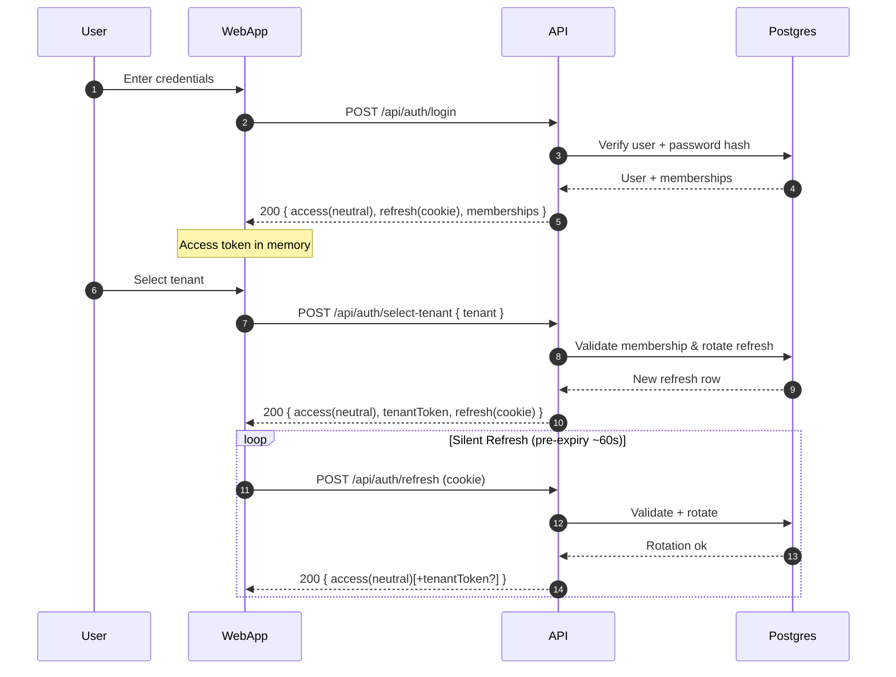
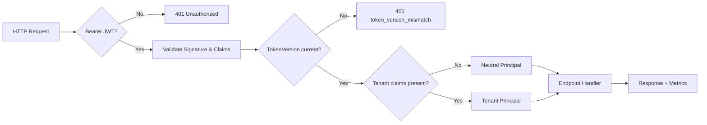
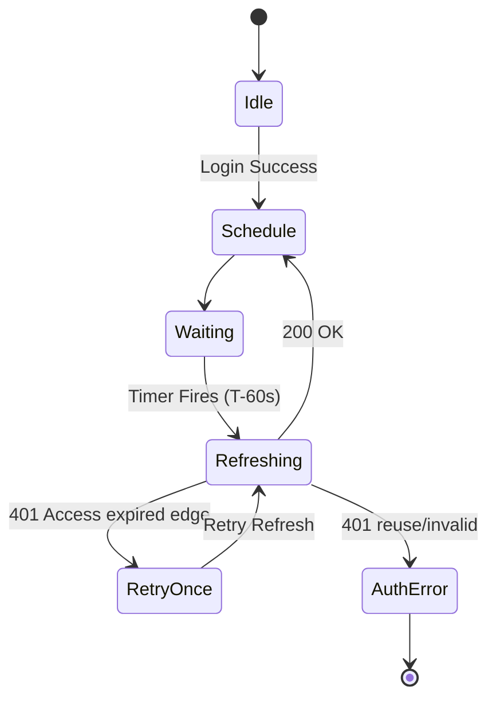

## Appostolic — Architecture Snapshot (Authoritative Baseline)

Generated: 2025-09-23 (updated: key rotation metrics + health endpoint implemented; superadmin deterministic claim issuance in tests; stricter notifications cross-tenant guard)
Purpose: Provide enough stable context for future AI/chat sessions without frequent edits. Update ONLY when architecture (structure, auth model, core data shapes, cross‑cutting concerns) materially changes. Operational / narrative history belongs in `devInfo/storyLog.md`.

---

### 1. Monorepo Overview

Tooling: pnpm workspaces + Turborepo (JS/TS) / .NET 8 solution.

Top-level domains:

- `apps/api` (ASP.NET Core Minimal API, EF Core, OpenTelemetry)
- `apps/api.tests` (integration + regression tests; deterministic seeding + real auth flow subset)
- `apps/api.e2e` (HTTPS cookie / end‑to‑end harness)
- `apps/web` (Next.js 14 App Router, React 18, TypeScript, MUI)
- Workers scaffolds: `apps/notifications-worker`, `apps/render-worker`
- `apps/mobile` (Expo/React Native scaffold)
- Shared packages: `packages/models` (domain DTO/types), `packages/sdk` (API client), `packages/ui` (shared React components), `packages/prompts`, `packages/docgen`, `packages/video-scenes`
- `infra` (docker compose: Postgres, Redis, MinIO, Mailhog, Qdrant; devcontainer; GitHub workflows)
- `devInfo` (sprint plans, story log, living checklist, design docs)

Primary Focus Areas (current baseline):

1. Unified JWT authentication (neutral + tenant access tokens, hashed refresh rotation).
2. Roles/authorization via bit flags (TenantAdmin, Approver, Creator, Learner) — legacy single role removed.
3. Dev header authentication fully decommissioned (single auth path).
4. Early observability (OpenTelemetry metrics/traces/logs) for auth & agent runtime.

---

### 2. High-Level Architecture Diagram (Conceptual Text)

User / Client (Web | Mobile | Automation)
→ HTTPS → API (Minimal APIs)
→ EF Core (PostgreSQL)
→ Object Storage (MinIO/S3)
→ Redis (ephemeral / future cache)
→ Email Providers (SMTP/Mailhog, SendGrid)
→ (Future) Vector/Qdrant
→ Background Agents (Hosted services / future workers)

Front-end obtains Access + Refresh (cookie) via Login → stores access token in memory → silent refresh → tenant selection for scoped access token.

---

### 3. Authentication & Session Model

Tokens:

- Neutral Access Token (short-lived JWT; no tenant claims; claim `v` = TokenVersion)
- Tenant Access Token (short-lived JWT; adds `tenant_id`, `tenant_slug`, roles flags claim)
- Refresh Token (opaque random; stored only hashed: Base64(SHA256); delivered via httpOnly cookie `rt`)

Core Flows:

1. Login (`/api/auth/login`) → returns neutral access + refresh (cookie) + memberships list; auto-issues tenant token only if exactly one membership.
2. Select Tenant (`/api/auth/select-tenant`) → exchanges neutral refresh for new rotated refresh + tenant-scoped access token.
3. Refresh (`/api/auth/refresh`) → rotates refresh, returns new neutral access (optionally tenant token if query `tenant=` supplied`). During rotation the old refresh token row has `LastUsedAt`stamped (if null) just before its`RevokedAt` is set, preserving historical usage while excluding it from active session enumeration.
4. Logout single (`/api/auth/logout`) → revoke specific refresh (cookie or provided); logout all (`/api/auth/logout/all`) → revoke all + increment `TokenVersion`.
5. Session enumeration (`/api/auth/sessions`) → lists up to 50 active (non‑revoked, unexpired) neutral refresh tokens for the authenticated user including: `id, createdAt, lastUsedAt, expiresAt, fingerprint, current`. `current` is determined by hashing the inbound `rt` cookie value and comparing to stored `TokenHash`.
6. Per‑session revoke (`/api/auth/sessions/{id}/revoke`) → idempotent revoke of a single active refresh token; emits security event `session_revoked_single` on first revoke.

Security Features:

- Refresh rotation & reuse detection (reusing revoked token => 401 `refresh_reuse`).
- TokenVersion revocation: any password change or logout-all increments user row `TokenVersion`; older access tokens rejected (`token_version_mismatch`).
- Plaintext refresh token NOT emitted unless transitional flag explicitly enabled (default suppressed; relies solely on cookie).
- Structured error codes for determinism (`refresh_invalid`, `refresh_reuse`, `refresh_expired`, `missing_refresh`, `dev_headers_removed`, etc.).
- HTTPS enforcement outside Development/Test + HSTS.

Removed / Deprecated:

- Dev header auth handler & composite scheme (replaced by single JWT bearer pipeline). Guard tests & grep patterns prevent reintroduction.

Superadmin Elevation:

- Config-driven allowlist (`Auth:SuperAdminEmails`) injects claim for privileged admin actions (e.g., notifications admin endpoints). Deterministic test token issuance (`TestAuthSeeder`) now mirrors this allowlist so tests bypassing `/auth/login` still receive the claim when appropriate.
- Notifications listing endpoint now returns 403 if a non-superadmin explicitly supplies a different `tenantId` query (previously silently scoped). Superadmins may filter any tenant.

---

### 4. Authorization & Roles

Bit flag enum `Roles`:

- TenantAdmin (1), Approver (2), Creator (4), Learner (8)
  Stored on `memberships.roles` (int). All gating & UI derive from flags only. Legacy string role & fallbacks removed.

Policies: `TenantAdmin`, `Approver`, `Creator`, `Learner` map to flag requirements; enforced via custom `RoleAuthorizationHandler` (checks bitmask). 403 responses unified as RFC7807 problem+json with optional `tenantId` and `requiredRoles` context.

Audit Trail: Membership role changes produce `audits` row (old/new flags, who changed).

---

### 5. Data Persistence (Selected Entities)

Core tables (schema `app`):

- `users` (Id, Email, PasswordHash/Salt, Profile JSONB, TokenVersion)
- `tenants` (Id, Name unique, Settings JSONB)
- `memberships` (Id, TenantId, UserId, Roles flags, Status)
- `invitations` (granular Roles, Token, ExpiresAt)
- `refresh_tokens` (Id, UserId, TokenHash, Purpose, ExpiresAt, RevokedAt, Fingerprint?, LastUsedAt?, Metadata JSONB)
  - Story 8: Added nullable `Fingerprint` (client-provided device/browser hint via header `X-Session-Fp` default; not security sensitive) and `LastUsedAt` (updated on successful validation and pre-rotation to preserve usage evidence). Partial index created for efficient active listing: `CREATE INDEX ix_refresh_tokens_active_user ON app.refresh_tokens (user_id, created_at DESC) WHERE revoked_at IS NULL;`
- `login_tokens` (magic link tokens: Email (citext), TokenHash, Purpose, Expires/Consumed)
- `audits` (role change records)
- `lessons` (sample domain / future content)

All migrations live under `apps/api/Migrations`. Use `make migrate` to add new migration (generates `.cs` + `.Designer.cs`). DB guard ensures required TTL aux tables exist on startup.

Multi-Tenancy Runtime:

- Tenant context derived from selected tenant token or explicit `X-Tenant-Id` header for certain prototype endpoints (header path will move to strict token claims for RLS in future hardening).
- Middleware sets PostgreSQL local setting via `app.set_tenant()` function when header supplied (prototype).

---

### 6. Frontend (Next.js App Router)

Auth Client:

- Access token stored only in memory; refresh cycle via `/api/auth/refresh` (cookie); silent refresh scheduled ~60s pre-expiry (single-flight).
- Retry-once 401 logic: if an API call 401s, trigger an immediate refresh and retry request once before surfacing error.

Role Gating:

- Components & routes compute booleans from flags bitmask; no legacy role fallback. Admin areas gated by presence of TenantAdmin in active membership.

State & UI:

- MUI theming; server components for data fetch (RSC). File upload components for avatars/logos integrate with object storage (MinIO/S3) through proxy endpoints.

Testing:

- Vitest + React Testing Library for UI logic. Integration tests use API proxy mocks with real JWT flows (dev headers removed).

---

### 7. Deterministic Test Strategy (API)

Principles:

1. Only a minimal set of suites perform full password→login→select-tenant flows (auth endpoints coverage, rotation, revocation, refresh, logout, cookie HTTPS behavior).
2. All other integration/domain tests seed data via deterministic helpers and issue tokens via a controlled issuance helper (`TestAuthSeeder` / token service), eliminating brittle multi-step sequences.
3. Unique test data fragments generated via shared `UniqueId` utility (Frag / Slug / Email) to avoid inline Guid slicing.
4. Guard tests ensure deprecated helpers & dev header patterns cannot reappear.

Outcome: Faster, stable tests (API: ~240 tests total; majority deterministic) with high confidence that critical auth behaviors still validated via authentic subset.

---

### 8. Observability

OpenTelemetry instrumentation (configurable exporter endpoint):

- Traces: ASP.NET Core, HttpClient, custom sources (`Appostolic.AgentRuntime`, `Appostolic.Tools`, `Appostolic.Auth`).
- Metrics: Auth counters (login success/failure, refresh success/failure, rotation, reuse denied, logout single/all, plaintext emission/suppression TEMP), histograms for login/refresh latency, refresh limiter evaluation histogram, key rotation counters (`auth.jwt.key_rotation.tokens_signed{kid}`, `auth.jwt.key_rotation.validation_failure{phase}`), session metrics (`auth.session.enumeration.requests{outcome=success|disabled}`, `auth.session.revoke.requests{outcome}`), security events (`auth.security.events_emitted{type}`), tracing enrichment (`auth.trace.enriched_spans{span_kind,outcome}`).
- Logs: Structured console (dev), OTLP exporter if configured.

Future (not yet baseline): Span enrichment (user/tenant anonymized dimensions), dashboards, anomaly detection.

- Auth tracing enrichment: standardized auth span attributes (`auth.user_id`, optional `auth.tenant_id`, `auth.outcome`, optional `auth.reason`) emitted only on auth operation spans (login/refresh/logout). No PII (emails, raw tokens) recorded.
- Metric `auth.trace.enriched_spans{span_kind, outcome}` increments each time enrichment occurs; supports dashboard correlation between span volume and auth outcomes.

---

### 9. Email & Notifications

Providers:

- SMTP (Mailhog default in development)
- SendGrid (production path; guarded by key presence)

Notification Dispatch (early): Deduplication table `notification_dedupes` (TTL enforced externally / future job). Background hosted service handles queued tasks; in-memory queue currently (future persistent/Redis/Queue service planned).

---

### 10. Storage & Media

Abstraction `IObjectStorageService` with Local FS or S3/MinIO implementations. Media served under `/media/*` via static files pointing to build-out directory (`web.out/media`). Avatar/logo processing uses ImageSharp (transforms: auto-orient, optional crop/downscale) preserving original format.

---

### 11. Agents & Tooling (Early Runtime)

Agent runtime (prototype) features:

- Tool registry (WebSearchTool, DbQueryTool, FsWriteTool) registered as singletons.
- Orchestrator + InMemory task queue + hosted worker `AgentTaskWorker`.
- Trace writer emits spans for agent/tool execution.

Planned: External queue integration, model adapter expansions, persistence of task transcripts.

---

### 12. Flags & Configuration (Selected)

Examples (ENV or config):

- `Auth:Jwt:SigningKey` (Base64 256-bit) — required outside Development (ephemeral dev key auto-generated otherwise).
- `AUTH__REFRESH_JSON_EXPOSE_PLAINTEXT` (bool; transitional, default false)
- `AUTH__REFRESH_JSON_GRACE_ENABLED` (bool; allows JSON body refresh fallback during migration)
- `Auth:SuperAdminEmails` (comma-separated superadmin allowlist)
- `Storage:Mode` (local | s3)
- `E2E_INMEM_DB` (bool; enable EF InMemory for certain E2E runs)

Removed Flags (do not resurrect): `AUTH__ALLOW_DEV_HEADERS`.

---

### 13. Security Baseline

Practices:

- Refresh tokens hashed at rest; plaintext ephemeral (cookie value only) & suppressed by default.
- Access tokens short-lived (TTL in config; rotation via refresh).
- TokenVersion bump invalidates outstanding access tokens (no global access token blacklist needed).
- Principle of least privilege: roles flags drive gating; superadmin isolated and explicit.
- HTTPS enforced outside dev/test; cookie `Secure` attribute honors actual HTTPS detection.
- Structured 401/403 error codes enable deterministic test assertions and potential client automation.

Upcoming Hardening (not yet implemented baseline): Multi-key signing/rotation, session enumeration + selective revoke, CSRF strategy review if cross-site embedding arises, anomaly detection on refresh reuse attempts.

Refresh Rate Limiting (Story 3 — 2025-09-23):

- Endpoint `/api/auth/refresh` guarded by in-memory sliding window limiter (single evaluation per request). Key = (userId, ip) if refresh token valid; otherwise IP-only to detect brute-force invalid token spam.
- Config: `AUTH__REFRESH_RATE_LIMIT_WINDOW_SECONDS`, `AUTH__REFRESH_RATE_LIMIT_MAX`, `AUTH__REFRESH_RATE_LIMIT_DRY_RUN` (dry-run increments counters but never blocks; emits observability events so thresholds can be tuned safely).
- Enforcement: If attempts within window exceed Max (and not dry-run) responds 429 `{ code: "refresh_rate_limited", retryAfterSeconds }`.
- Metrics: Histogram `auth.refresh.limiter.evaluation_ms{outcome=hit|block|dryrun_block}` records evaluation latency + outcome for tuning / anomaly tracking.
- Security Events: Structured JSON log (`type: refresh_rate_limited`) emitted for real blocks and dry-run would-blocks (with `meta.dry_run=true`) including `ip`, optional `user_id`, optional `refresh_id`.
- Rationale: Early abuse resistance with minimal complexity; single evaluation avoids double-counting and simplifies mental model. Future distributed backend (Redis) or algorithm swap (token bucket) can wrap the same interface.

---

### 14. Deployment / Ops (Current Minimal)

Local: docker compose services (db, redis, minio, mailhog, qdrant). Makefile convenience targets (api run, migrations, trust dev certs). No production infrastructure manifest included here (refer to infra directory & CI workflows).

Rollback Strategy (Auth changes): Pre-removal tags (e.g., `before-dev-header-removal`) created prior to destructive auth refactors; rollback = checkout tag or revert commit chain; docs in story log.

---

### 15. Testing Matrix Summary

API Integration Suites: Cover auth flows (login/select/refresh/logout), invitations, memberships, role changes/audits, notifications admin, agent tasks, storage/media, privacy, negative security paths.
E2E Harness: HTTPS cookie & secure attribute validation.
Web Tests: Auth client behavior (silent refresh, retry), role gating, UI form flows (settings, invites, avatars/logos), routing protection.
Guard Tests: Forbid dev header usage, legacy identifier helpers, unauthorized role fallback paths.

---

### 16. Extension & Change Guidelines

WHEN TO UPDATE THIS FILE:

1. Introducing new cross-cutting subsystem (e.g., GraphQL gateway, queue-backed workers).
2. Material auth model shift (e.g., multi-key JWK rotation, external IdP integration).
3. Data model fundamental change (core table addition/removal affecting majority of flows).
4. Observability architecture overhaul (tracing/metric pipeline redesign).
5. Security baseline expansion (e.g., session listing + selective revoke release, CSRF strategy change).

Otherwise prefer updating `devInfo/storyLog.md` and sprint plan documents.

---

### 17. Quick Reference (Cheat Sheet)

Auth Endpoints: `/api/auth/login`, `/api/auth/refresh`, `/api/auth/select-tenant`, `/api/auth/logout`, `/api/auth/logout/all`, `/api/auth/sessions`, `/api/auth/sessions/{id}/revoke`
Token Claims (neutral): `sub`, `v` (token version)
Token Claims (tenant): `sub`, `v`, `tenant_id`, `tenant_slug`, `roles` flags (numeric or baked logic server-side)
Error Codes (examples): `refresh_invalid`, `refresh_reuse`, `refresh_expired`, `missing_refresh`, `token_version_mismatch`, `dev_headers_removed`
Key Tables: `users`, `memberships`, `refresh_tokens`, `invitations`, `audits`, `login_tokens`, `tenants`
Roles Flags: Admin=1, Approver=2, Creator=4, Learner=8 (combine bitwise OR)
Refresh Hashing: Base64(SHA256(plaintext)) — never store plaintext

---

End of Snapshot.

---

### Appendix A — Visual Diagrams (Mermaid)

These diagrams are code-review friendly. Update only if underlying flow/relationships materially change.

#### A1. Auth Sequence (Login → Select Tenant → Refresh Loop)



#### A2. Request Auth Flow (Decision Path)



#### A3. Component Overview

```mermaid
graph TD
  subgraph Clients
    W[Web (Next.js)]
    M[Mobile (Expo)]
  end
  subgraph API[.NET Minimal API]
    A1[Auth Endpoints]
    A2[Domain Endpoints]
    A3[Agent Runtime]
    A4[Notifications]
  end
  subgraph Persistence
    DB[(Postgres)]
    OBJ[(MinIO/S3)]
    REDIS[(Redis)]
  end
  subgraph External
    SG[SendGrid]
    SMTP[SMTP/Mailhog]
  end
  W --> A1
  M --> A1
  W --> A2
  M --> A2
  A1 --> DB
  A2 --> DB
  A2 --> OBJ
  A3 --> DB
  A3 --> REDIS
  A4 --> DB
  A4 --> SG
  A4 --> SMTP
```

#### A4. Core Entity Relationships (Abbreviated)

```mermaid
erDiagram
  USER ||--o{ MEMBERSHIP : has
  TENANT ||--o{ MEMBERSHIP : contains
  USER ||--o{ REFRESH_TOKEN : owns
  USER ||--o{ LOGIN_TOKEN : requests
  TENANT ||--o{ INVITATION : issues
  USER ||--o{ INVITATION : creates
  MEMBERSHIP ||--o{ AUDIT : changesRoles

  USER {
    uuid Id
    string Email
    int TokenVersion
  }
  TENANT {
    uuid Id
    string Name
  }
  MEMBERSHIP {
    uuid Id
    uuid TenantId
    uuid UserId
    int Roles
  }
  REFRESH_TOKEN {
    uuid Id
    uuid UserId
    string TokenHash
    datetime ExpiresAt
    datetime? RevokedAt
  }
  LOGIN_TOKEN {
    uuid Id
    citext Email
    string TokenHash
    datetime ExpiresAt
    datetime? ConsumedAt
  }
  INVITATION {
    uuid Id
    uuid TenantId
    string Email
    int Roles
    datetime ExpiresAt
  }
  AUDIT {
    uuid Id
    uuid TenantId
    uuid UserId
    int OldRoles
    int NewRoles
    datetime ChangedAt
  }
```

#### A5. Silent Refresh State Machine



End of Appendix.
